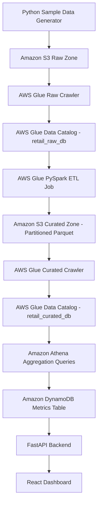
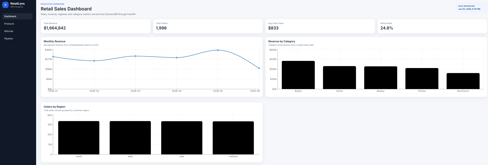
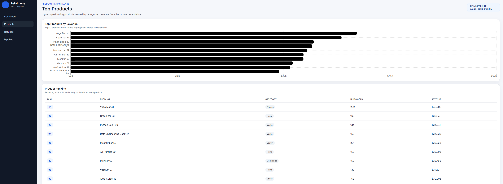
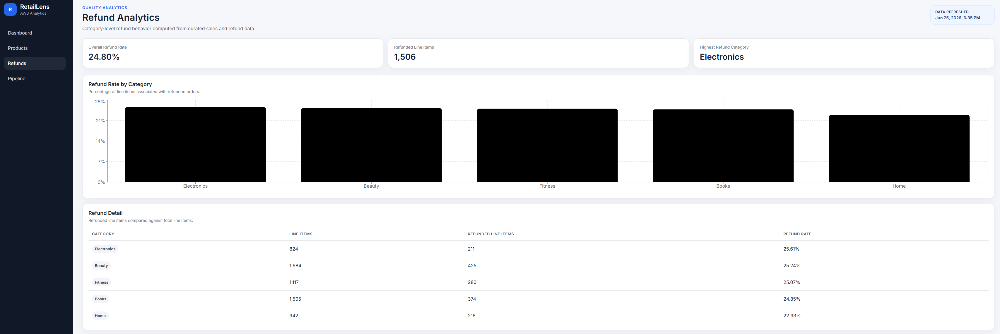
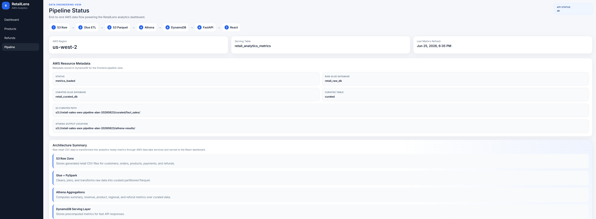

# RetailLens: AWS Retail Analytics Platform

RetailLens is a full-stack retail analytics platform built with AWS S3, AWS Glue, Amazon Athena, Amazon DynamoDB, FastAPI, and React.

The project simulates a real e-commerce analytics workflow where raw sales data is uploaded to a data lake, transformed into curated Parquet data, aggregated into business metrics, stored in DynamoDB for low-latency access, and visualized in a React dashboard.

## Live Demo

* Frontend: https://retail.alanluu.net/
* Backend: https://retail-api.alanluu.net/docs

> Note: The backend may be hosted on a free tier, so the first request can take a short time to wake up.

## Features

* Executive sales dashboard with revenue, order count, average order value, and refund rate
* Monthly revenue trend visualization
* Revenue by product category
* Orders by customer region
* Product performance page showing top products by revenue
* Refund analytics page showing refund rate by category
* Pipeline status page showing AWS data flow and metadata
* FastAPI backend serving precomputed metrics from DynamoDB
* React frontend with reusable dashboard components and charts

## Architecture



## Tech Stack

| Layer             | Technology            |
| ----------------- | --------------------- |
| Data Lake Storage | Amazon S3             |
| Schema Discovery  | AWS Glue Crawlers     |
| Metadata Catalog  | AWS Glue Data Catalog |
| ETL               | AWS Glue PySpark      |
| Query Engine      | Amazon Athena         |
| Serving Layer     | Amazon DynamoDB       |
| Backend           | FastAPI               |
| Frontend          | React, Vite, Recharts |
| Deployment        | Render, Vercel        |

## Data Pipeline

Raw e-commerce CSV files are generated locally and uploaded to Amazon S3. AWS Glue Crawlers catalog the raw data, and a Glue PySpark job transforms the raw tables into a curated `fact_sales` Parquet dataset partitioned by `order_year` and `order_month`.

Athena queries the curated dataset to calculate metrics such as revenue by category, monthly revenue, top products, refund rates, and regional order volume. These precomputed metrics are written to DynamoDB and served through FastAPI for fast dashboard reads.

For more detail, see:

* [`docs/architecture.md`](docs/architecture.md)
* [`docs/aws-data-pipeline.md`](docs/aws-data-pipeline.md)

## Application Pages

### Dashboard

Shows executive-level KPIs and charts:

* Total revenue
* Total orders
* Average order value
* Refund rate
* Monthly revenue
* Revenue by category
* Orders by region

### Products

Shows top product performance:

* Product ranking
* Units sold
* Product category
* Recognized revenue

### Refunds

Shows quality and refund analytics:

* Overall refund rate
* Refunded line items
* Highest refund category
* Refund rate by category

### Pipeline

Shows technical pipeline metadata:

* AWS region
* DynamoDB table
* Glue databases
* Curated Athena table
* S3 curated path
* Last metrics refresh timestamp

## Screenshots

### Dashboard



### Products



### Refunds



### Pipeline



## Local Development

### Backend

```bash
cd backend
pip install -r requirements.txt
uvicorn app.main:app --reload --port 8000
```

Backend environment variables:

```env
AWS_REGION=us-west-2
DYNAMODB_TABLE=retail_analytics_metrics
```

### Frontend

```bash
cd frontend
npm install
npm run dev
```

Frontend environment variable:

```env
VITE_API_BASE_URL=http://127.0.0.1:8000
```

## Utility Scripts

Generate sample retail data:

```bash
python scripts/generate_sample_data.py
```

Load Athena aggregation results into DynamoDB:

```bash
python scripts/load_metrics_to_dynamodb.py
```

## Key Concepts Demonstrated

* AWS data lake architecture with raw and curated zones
* Glue Crawlers and Glue Data Catalog for schema discovery
* PySpark ETL with AWS Glue
* Parquet output and partitioning for analytics
* Athena SQL queries over S3 data
* DynamoDB as a low-latency serving layer
* FastAPI REST API design
* React dashboard development
* Separation of analytics processing and application serving

## Project Summary

RetailLens demonstrates an end-to-end AWS analytics workflow: raw e-commerce data is stored in S3, cataloged with Glue, transformed with Glue PySpark, queried with Athena, stored as precomputed metrics in DynamoDB, served through FastAPI, and visualized in a React dashboard.
